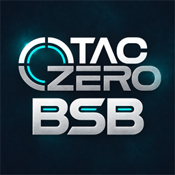

# TACZ: Better Streamline Bullet

**English** | [简体中文](README.zh-CN.md)



A Minecraft addon for **NeoForge 1.21.1** and **Forge 1.20.1** that rewards ammunition automation. Existing Create: TaCZ assembly lines produce **Improved** ammunition, new high-energy material production lines produce **Precise** ammunition, and TaCZ workbenches continue to produce ordinary ammunition.

- Mod ID: `tacz_bsb`
- Version: `1.0.0-beta` (artifact filenames include the loader)
- Author: Sange
- License: [MIT](LICENSE)
- Java package: `com.sange.tacz_bsb`

## Ammunition and production

| Tier | Item ID | Name color | Default direct / explosion damage multiplier | Production |
| --- | --- | --- | --- | --- |
| Ordinary | `tacz:ammo` | Original TaCZ color | 1 / 1 | TaCZ workbench |
| Improved | `tacz_bsb:improved_ammo` | Orange | 1.5 / 1.5 | Existing Create: TaCZ assembly lines |
| Precise | `tacz_bsb:precise_ammo` | Purple | 2 / 2 | High-energy materials and hardened projectiles |

- Each tier uses TaCZ's `AmmoId` to distinguish calibers. All 24 default ammunition types and valid ammunition added by gun packs are enabled by default. Enhanced ammunition reuses the original names and models, adds Minecraft's enchantment glint, appears in the TaCZ ammunition creative tab, and supports JEI subtypes.
- The original Create: TaCZ final ammunition assembly recipes now produce Improved ammunition. Recipe IDs, yields, chances, and operation order are preserved. Workbench recipes remain available.
- High-energy materials and hardened projectiles provide Precise production chains. Completed materials appear in the **Create: TaCZ creative tab**; unfinished items from both mods are hidden from creative tabs, creative search, and JEI search. Materials reuse their original models with enchantment glint.
- Magazines can contain all three ammunition tiers. The mod tracks magazine order, chamber contents, and ammunition being loaded. The lower-right HUD shows the next round's tier.
- Direct-hit and explosion multipliers can be configured separately for each enhanced tier. Existing damage falloff, blast radius, and knockback rules are preserved.

| Target | Improved / Precise final recipes | Added materials (completed / unfinished) | Precise recipes |
| --- | --- | --- | --- |
| NeoForge 1.21.1 | 24 / 24 | 88 (38 / 50) | 64 |
| Forge 1.20.1 | 21 / 21 | 79 (35 / 44) | 58 |

Forge Create: TaCZ 1.0.2 has no production chains for .22 WMR, .500 Magnum, or 8mm Mauser. Both enhanced variants still exist for all 24 default calibers; custom recipes can be supplied with datapacks or KubeJS for those three calibers.

### Material recipes

| Material / operation | Recipe |
| --- | --- |
| High-Energy Gunpowder Cake | 2 gunpowder + 1 charcoal + 250 mB water + 1 rose quartz, heated mixing → 10 |
| High-Energy Dry Gunpowder Cake | Smoke High-Energy Gunpowder Cake; same duration as the original recipe |
| High-Energy Gunpowder Cylinder | Compact 10 High-Energy Dry Gunpowder Cakes → 1 |
| High-Energy Gunpowder Charge | Press 1 High-Energy Dry Gunpowder Cake → 4 |
| Powder derivatives | 1 High-Energy Charge ⇄ 5 High-Energy Pellets; 1 High-Energy Pellet ⇄ 4 High-Energy Grains |
| High-Energy Explosive | Mix 1 powdered obsidian + 2 blaze powder + 2 gunpowder → 4; no heating required |
| Hardened projectiles | Small bullets, large bullets, and metal pellets: fill with 100 mB lava → press once → fill with 100 mB water; one assembly loop, 1 input → 1 output |
| High-Energy Prepared Casings | Original casing and primer, with high-energy powder substituted; 12g also uses hardened metal pellets |
| Precise conventional ammunition | High-Energy Prepared Casing + hardened projectile; original assembly loops and yields |
| Precise RPG Warhead | Original mechanical crafting recipe, replacing gunpowder with High-Energy Explosive |
| Precise RPG Sustainer Motor / Booster Charge | Original mechanical crafting recipes, replacing gunpowder cylinders with high-energy cylinders |
| Precise 40mm grenade components | Explosive charge and fuse use the corresponding high-energy powder; the fuseless grenade uses the Precise charge and High-Energy Gunpowder Charge |

There is no high-energy primer mix or recipe combining high-energy charge with redstone to make primer mix. `tacz_c:booster_charge_40mm` remains unchanged. RPG and grenade components use the **Precise** designation rather than **Hardened**.

Set the basin filter to High-Energy Gunpowder Cake to prevent ordinary gunpowder cake from being produced before all ingredients arrive.

The ammunition assembly chains preserve the original operation order and ingredient quantities. In the NeoForge recipes, .22 Winchester receives its primer before high-energy powder; 12g follows the paper shell, primer, high-energy powder, wad, and hardened pellets sequence. After shared initial operations, the deployer follows the branch matching the supplied powder. Once different powder is consumed, that branch is locked. Intermediate items track their own Create assembly progress. Material IDs are listed in [BsbMaterials.java](versions/mc-1.21.1/neoforge/src/main/java/com/sange/tacz_bsb/BsbMaterials.java).

## Mixed loading and unloading

Ammunition is taken from the player's inventory in TaCZ slot order, tracking the actual quantities and tiers consumed. Chambered rounds fire first. Closed-bolt guns feed the next magazine round into the chamber after firing; manual-action guns require cycling the action.

By default, newly loaded rounds are placed before remaining magazine rounds, preserving extraction order within the new batch. `tacz:12g` defaults to appending rounds for tubular magazines. Configure this with `fifoAmmo`. There is no separate ammunition-selection hotkey.

TaCZ's own unloading path returns the corresponding ammunition tiers from the magazine and retains its original chamber behavior. To empty the chamber as well, hold the gun and run:

```mcfunction
/tacz_bsb unload
```

This also ends the current reload or bolt operation. Survival ammunition returns to the inventory at its recorded tier; overflow drops beside the player.

A regular ammunition box holds one caliber and one tier, rejecting mixed contents. Its tooltip directly displays the stored ammunition's name and icon: orange for Improved, purple for Precise, both with glint. There is no additional “contains…” description. Creative boxes retain unlimited supply. Dummy ammunition is ordinary-tier only. Loaded fuel follows TaCZ's non-refundable unloading behavior, preventing one fuel unit from becoming multiple ammunition items. Ammunition created by infinite loading is not converted into items through unloading.

Two universal creative ammunition boxes appear in the same TaCZ creative tab as the original boxes:

- `tacz_bsb:improved_universal_ammo_box`: Improved Universal Creative Ammo Box, orange name.
- `tacz_bsb:precise_universal_ammo_box`: Precise Universal Creative Ammo Box, purple name.

Both supply unlimited ammunition of the current gun's caliber at their fixed tier, without configuring a caliber beforehand. Newly loaded rounds take the box's tier; existing rounds retain their tier and order. Standard TaCZ gun packs and inventory-fed guns are supported. These boxes reuse the original universal box model and glint and have no survival crafting recipe.

New TaCZ gun items without this mod's ammunition record initialize their existing loaded rounds as ordinary ammunition. Changing creative-tab generation settings does not remove existing ammunition.

## Configuration and gun-pack support

Two configuration files are created on first launch. Standard TaCZ gun packs do not require Java changes: matching uses the gun's `AmmoId`. Gun packs must provide valid TaCZ ammunition definitions and the original name and texture resources.

`config/tacz_bsb-common.toml` controls the enhanced ammunition shown in creative tabs and automatic Improved recipe replacement. Use matching client/server settings and restart after editing.

```toml
enabledImprovedAmmo = ["*"]
enabledPreciseAmmo = ["*"]
recipeNamespaces = ["tacz_c"]
```

Enable lists accept `*`, `tacz:*`, or complete AmmoIds; either list may be empty. By default, both variants are offered for every valid ammunition definition. In `recipeNamespaces`, ordinary final ammunition outputs from Create sequenced assembly recipes become Improved ammunition. Modpack authors supply recipes for additional gun packs; this mod provides Precise production chains for the default Create: TaCZ content.

`tacz_bsb-server.toml` is synchronized to clients by the loader. Edit the generated file in the instance's `config/` or world's `serverconfig/` directory as applicable.

```toml
improvedDirectDamageMultiplier = 1.5
improvedExplosionDamageMultiplier = 1.5
preciseDirectDamageMultiplier = 2.0
preciseExplosionDamageMultiplier = 2.0
improvedDamageOverrides = []
preciseDamageOverrides = []
fifoAmmo = ["tacz:12g"]
hudOffsetX = 0
hudOffsetY = 0
```

Example: enable Improved ammunition for one additional pack and Precise ammunition for another:

```toml
# Common config: replace the example pack IDs.
enabledImprovedAmmo = ["tacz:*", "my_pack:custom_round"]
enabledPreciseAmmo = ["tacz:*", "another_pack:custom_round"]
```

```toml
# Server config: direct-hit multiplier, then explosion multiplier; range 0–100.
improvedDamageOverrides = ["my_pack:custom_round=1.8,1.6"]
preciseDamageOverrides = ["another_pack:custom_round=2.5,3.0"]
```

For **NeoForge 1.21.1**, KubeJS or datapack recipe outputs can use the following format without modifying the mod. Replace `precise_ammo` with `improved_ammo` for the Improved variant:

```json
{
  "id": "tacz_bsb:precise_ammo",
  "count": 16,
  "components": {
    "minecraft:custom_data": { "AmmoId": "my_pack:custom_round" }
  }
}
```

For example, a KubeJS server script can add a mixing recipe:

```js
ServerEvents.recipes(event => {
  event.custom({
    type: 'create:mixing',
    ingredients: [{ item: 'minecraft:iron_ingot' }], // Placeholder ingredient; design your own recipe.
    results: [{
      id: 'tacz_bsb:precise_ammo', count: 16,
      components: { 'minecraft:custom_data': { AmmoId: 'my_pack:custom_round' } }
    }]
  })
})
```

Give yourself either variant directly on **NeoForge 1.21.1**:

```mcfunction
/give @s tacz_bsb:improved_ammo[minecraft:custom_data={AmmoId:"tacz:9mm"}] 64
/give @s tacz_bsb:precise_ammo[minecraft:custom_data={AmmoId:"tacz:9mm"}] 64
```

For **Forge 1.20.1**, Create recipe outputs use `item` and `nbt`:

```json
{ "item": "tacz_bsb:precise_ammo", "count": 16, "nbt": { "AmmoId": "my_pack:custom_round" } }
```

```mcfunction
/give @s tacz_bsb:improved_ammo{AmmoId:"tacz:9mm"} 64
/give @s tacz_bsb:precise_ammo{AmmoId:"tacz:9mm"} 64
```

The enhanced tiers are separately registered items; calibers within each tier are variants carrying an AmmoId. Configuration controls display and automatic recipe replacement without deleting existing items. Fixed Precise recipes can also be changed or removed with datapacks or KubeJS.

## Required dependencies

The gameplay features above are implemented for both targets. Each target uses its own dependency APIs and data format.

### NeoForge 1.21.1

| Mod | Pinned version | Build repository |
| --- | --- | --- |
| [TaCZ 1.21.1 NeoForge Port](https://modrinth.com/mod/tacz-1.21.1) | 1.1.8-hotfix-r6 | Modrinth Maven |
| [Create: TaCZ Port](https://www.curseforge.com/minecraft/mc-mods/create-timeless-and-classics-zero-tacz-port/files/8087867) | 1.0.2+neoforge.1.21.1 | Curse Maven |
| [Create](https://modrinth.com/mod/create/version/UjX6dr61) | 6.0.10 | Modrinth Maven |

NeoForge: 21.1.248. JDK: 21. The build downloads the dependencies and their bundled libraries automatically; there is no need to populate a `libs` directory. JEI is optional: only its API is downloaded for compilation. Install the matching JEI release separately to use it in-game.

The release JAR does not bundle these three prerequisite mods. Install them and this addon on both clients and servers. Mixins are verified against the versions above; upstream reload or shooting API changes may require updates.

### Forge 1.20.1

| Mod | Pinned version | Build repository |
| --- | --- | --- |
| [TaCZ](https://modrinth.com/mod/timeless-and-classics-zero/version/AzCBJlex) | 1.1.8-hotfix2 | Modrinth Maven |
| [Create: TaCZ](https://www.curseforge.com/minecraft/mc-mods/tacz-create/files/7327274) | 1.0.2 | Curse Maven |
| [Create](https://modrinth.com/mod/create/version/8amzvn9x) | 6.0.8 | Modrinth Maven |

Forge: 47.4.10. Game and target compilation require JDK 17; the Gradle launcher and `cores` compilation use JDK 21. The full TaCZ and Create releases include SimpleBedrockModel, LuaJ, BCEL, Commons Math, MixinExtras, Registrate, Flywheel, and Ponder. All prerequisite archives download automatically and remain separate from the BSB artifact. No manual `libs` directory or Forge Config API Port is required.

## Development policy

The code maintains only the current data format and behavior. It does not provide cross-version migration, old-format fallbacks, or historical compatibility branches. Initializing new TaCZ items, integrating with current dependency APIs, and checking data consistency remain normal functionality.

## Project layout and task selection

```text
cores/                          Pure Java ammunition state and shared logo
versions/
  mc-1.20.1/
    gradle.properties           Minecraft 1.20.1 and Java 17
    common/                     Loader-independent 1.20.1 code, recipes and resources
    forge/                      Forge implementation, metadata, and game tests
  mc-1.21.1/
    gradle.properties           Minecraft, mappings, and Java version
    common/                     Loader-independent 1.21.1 code and game resources
    neoforge/                   NeoForge implementation, metadata, and game tests
      gradle.properties         Pinned loader and mod dependency versions
```

The root `build`, `assemble`, `check`, and `clean` tasks aggregate all targets. `:mc-1.21.1:build` builds that version, while `:mc-1.21.1:neoforge:build` builds its NeoForge release and checks its shared modules. Each module owns its build output and development worlds. The `cores` and `common` JARs are development libraries; distribute the JAR for the selected loader, which includes their required contents.

Like TravelingMerchantWagon, Gradle discovers `common`, `neoforge`, `fabric`, and `forge` modules with build scripts under each `versions/mc-*` directory. The Forge and NeoForge implementations have separate common modules. Dependency-specific code stays in each loader target. The four recipes using NeoForge fluid ingredient codecs also remain in the NeoForge resource directory.

Launch a fully qualified loader task. To use short launch names locally, create an ignored `gradle-local.properties` file:

```properties
runTarget=:mc-1.21.1:neoforge
# Optional local JDK locations, separated by commas:
# org.gradle.java.installations.paths=D:/dev/java/jdk17,D:/dev/java/jdk21
```

You can also pass `-PrunTarget=:mc-1.21.1:neoforge`. Without a selected loader, bare launch tasks fail with a target-selection message instead of launching multiple versions.

## Building and testing

```powershell
.\gradlew.bat build
.\gradlew.bat :mc-1.20.1:forge:build
.\gradlew.bat :mc-1.20.1:forge:runGameTestServer
.\gradlew.bat :mc-1.20.1:forge:runClientSmoke -PjeiSmoke
.\gradlew.bat :mc-1.21.1:neoforge:runGameTestServer
.\gradlew.bat :mc-1.21.1:neoforge:runClientSmoke
```

Use `./gradlew` on Linux or macOS. The first build requires internet access. Release artifact: `versions/mc-1.21.1/neoforge/build/libs/tacz_bsb-neoforge-1.0.0-beta.jar`.

Forge release: `versions/mc-1.20.1/forge/build/libs/tacz_bsb-forge-1.0.0-beta.jar`. Its `verifyDependencies` check verifies the three required mods and their nine embedded libraries. The 18 server GameTests cover dependency loading, all 89 sequenced assemblies through Create machine APIs (44 BSB + 45 Create: TaCZ), 40 branch-switch routes, recipe networking, mixed loading/unloading, persistence, invalid NBT rejection, damage multipliers, RPGs, ammunition boxes, and universal boxes. `runClientSmoke -PjeiSmoke` also checks actual JEI search visibility and client rendering. Test code and structures are excluded from the artifact.

- `build` includes JUnit tests; reports are at `cores/build/reports/tests/test/index.html` and each version's `common/build/reports/tests/test/index.html`.
- Both loaders expose the same test tasks in their own subprojects. Forge test worlds and screenshots use `versions/mc-1.20.1/forge/build/`; its normal development runs use `versions/mc-1.20.1/forge/run`.
- `runGameTestServer` runs the actual dependencies and integration tests in `versions/mc-1.21.1/neoforge/build/gametest-run`, then exits.
- `runClientSmoke` first runs server tests and copies an isolated test world, then launches the client to check three-tier rendering for 24 calibers, creative tabs, state synchronization, and the HUD. It saves screenshots and exits automatically. A graphical environment is required; screenshots are in `versions/mc-1.21.1/neoforge/build/client-smoke/screenshots/`.
- Use `:mc-1.21.1:neoforge:runClient` / `:mc-1.21.1:neoforge:runServer` for normal development. GameTest classes and test structures have a separate `src/gameTest` source set and are excluded from the release JAR.

Integration checks are defined in [CompatibilityGameTests.java](versions/mc-1.21.1/neoforge/src/gameTest/java/com/sange/tacz_bsb/gametest/CompatibilityGameTests.java). These checks do not constitute exhaustive testing of third-party gun packs or modpacks.

This project is based on the NeoForged MDK. Its MIT notice is retained in [TEMPLATE_LICENSE.txt](TEMPLATE_LICENSE.txt).
